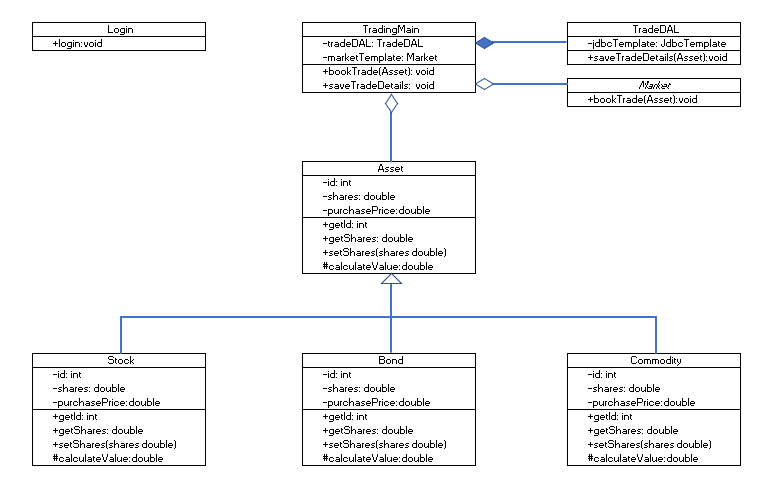

#  UML and Class Diagrams

### Learning Objectives

*After this lesson, students will be able to:*

* Explain how UML and class diagrams are used by developers.
* Identify which connectors to use in a class diagram.
* Write code based on a class diagram.

## Student Activity (35 min)

Let's get started coding our trading system from existing models. Here's the class diagram for a trading system:

  

Your task is to generate the Java classes represented in this diagram.

Note that `Market` is an interface, as indicated by the italics. All of the others are concrete (non-abstract) classes.

--- 
